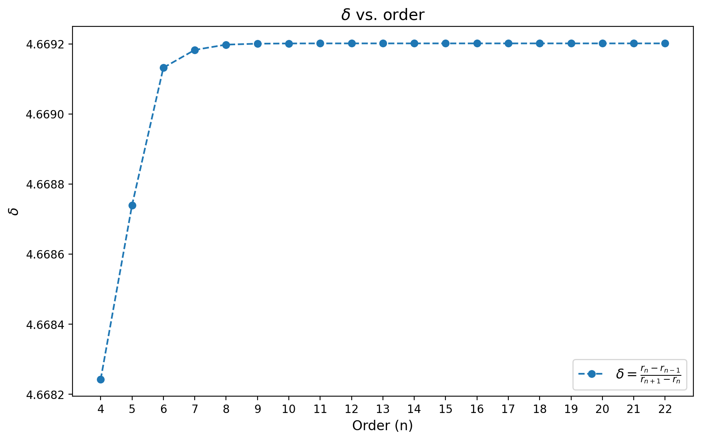

# Logistic Map Bifurcation
High-precision bifurcation analysis using Newton's method.

## Dependencies
- **Eigen**: Handles matrix and sparse matrix operations.

  ```shell
  sudo apt-get install libeigen3-dev
  ```

- **mpfr/mpreal**: Enables arbitrary-precision floating-point arithmetic.

  ```shell
  sudo apt-get install libgmp-dev libmpfr-dev
  git clone https://github.com/advanpix/mpreal.git
  sudo cp mpreal/mpreal.h /usr/local/include/
  ```

- **OpenMP**: Facilitates parallel computations.

## Method

Solve the following system of equations using Newton's method to find the onset of the $n$-cycle. Look at [Logistic Map -- from Wolfram MathWorld](https://mathworld.wolfram.com/LogisticMap.html)

$$
\left\{\begin{array}{l}
x_2=r x_1 (1-x_1) \\
x_3=r x_2 (1-x_2) \\
\vdots \\
x_n=r x_{n-1}(1-x_{n-1}) \\
x_1=r x_n (1-x_n) \\
r^n \prod_{k=1}^n (1-2 x_k)=1 .
\end{array}\right.
$$

## Result



| Order   | r_order                                                      |
| ------- | ------------------------------------------------------------ |
| 4       | 3.544090359551922853615965986604804540583099845444573675457812530305842942858863012256258566424891799962608992775899745457821208284579 |
| 8       | 3.564407266095432597773557586528982450657734738379008557741476335182332004294422641525831712108342216870457425438708911607262012748955 |
| 16      | 3.568759419543826431298210280025315370356993839580782079406831955080040976620512937679045966681269931557671544765377172993339325103164 |
| 32      | 3.569691609801396714288268706295466607186570408291517815417326303478155835317864636326320165704285925536075635041061434556576065657805 |
| 64      | 3.569891259378120487320271200585449389795825123374417804033274734553579776102035557574437785208426378789725094469042518839032431289603 |
| 128     | 3.569934018373976401184855601887191371219283012000622907680341596341875968328620239270702469471962282082993375384153064008637552265208 |
| 256     | 3.569943176048401636354442976162317749540806665640620306118378518597772099507309714300589713799277433146336235364248531115765516769885 |
| 512     | 3.569945137342169794314721122749530918691324187850263889301185701051610707234405037202332817749486199888381354494574320450934522742954 |
| 1024    | 3.56994555739124937611716994175620838011446395742974699701509254841204164475140937551230974417961092521670476850821398311776861811232 |
| 2048    | 3.56994564735289979134350665376033672215937988990389898980942575644019753489789868140891662580522512021295617748508442679625751991428 |
| 4096    | 3.56994566661993045219394370115113364346899845783748287442977172867777206811274551024130883876480231573314385223710146744956545852908 |
| 8192    | 3.569945670746338408144967161967614572885382203591420679254082537096973309929505027914156532007278393022407182345033014157197252976417 |
| 16384   | 3.569945671630088629643415291546148056248936397317703239852501366154966032421040720411762851354797168461987475731651850575743350027089 |
| 32768   | 3.569945671819360864063530243548834585053671440307165846535388774598617009694936511945765235984975298907134112172017021421838671451214 |
| 65536   | 3.569945671859897180604622834728044809559938584560436410055152607839958258925583068194192478994610196913935038419281857049582101226559 |
| 131072  | 3.569945671868578818266636432691957406149717154391156216514198688948471557743915235260708380046499338728995873208519145203668252699926 |
| 262144  | 3.569945671870438159196591016302395172142813680582562629293832468586805473154785140129152266759836931580943950186831456662131296147983 |
| 524288  | 3.569945671870836373085305890018028642336958145788136124520305086450990024119634448259259342159452963645250914471774114116690161284966 |
| 1048576 | 3.569945671870921658305789521755892741015973776802885672797118207447353428927637941492200876609211563400112769807897654833056305171405 |
| 2097152 | 3.569945671870939923788333124361377948295899347950308983055429200702784485508973543161216892235269396192390916680640705962149810035095 |
| 4194304 | 3.569945671870943835695351230531513277471325651547679095819154341857271151722770311637432376472638379360729784692789018738334232940529 |
